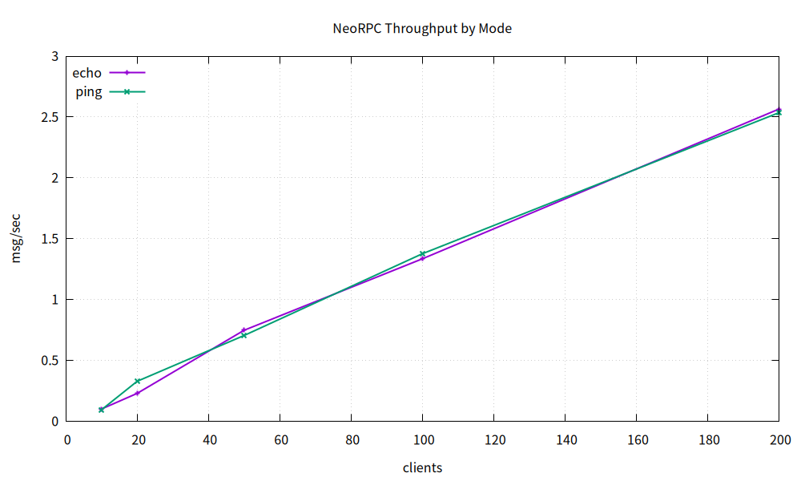

# NeoRPC

一个基于 C++20 协程与 `epoll` 的轻量级异步 RPC / 命令服务器原型。

## 👀 TL;DR

- 基于 `C++20 Coroutine + epoll` 实现单线程 Reactor 异步网络服务，支持非阻塞 IO、按行协议拆包与命令分发
- 使用 `X-Macro` 构建命令注册机制，引入 `CommandContext` 与 `ServiceRegistry` 支持服务扩展
- 提供压测脚本与图表输出能力；在本机回环、`messages=200`、`size=128` 条件下，不同并发配置下吞吐约 `1.2w ~ 2.1w msg/s`

## 📷 性能图预览



## ✨ 项目简介

NeoRPC 采用单线程 Reactor 模型，围绕非阻塞 IO、按行协议拆包、命令分发与服务上下文传递，实现了一个轻量级异步 RPC / 命令服务器。

当前项目重点覆盖：

- 基于 `epoll` 的事件循环
- 基于协程的异步读写
- 按行协议与半包处理
- 基于 `X-Macro` 的命令注册与分发
- `CommandContext` + `ServiceRegistry` 的服务扩展能力
- 压测脚本与吞吐 / 延迟图表输出

## 🗂️ 项目目录结构

```text
NeoRPC/
├── include/
│   ├── commands/          # 具体命令实现，如 PingCommand / EchoCommand
│   ├── services/          # 服务对象，如 StatsService
│   ├── EventLoop.hpp      # epoll 事件循环封装
│   ├── Conn.h             # 连接对象定义
│   ├── TcpServer.h        # 服务端定义
│   ├── LogicHandler.hpp   # 命令解析与分发入口
│   ├── Command.hpp        # 命令抽象与上下文
│   ├── CommandList.def    # X-Macro 命令注册表
│   └── ServiceRegistry.hpp
├── src/
│   ├── main.cpp           # 程序入口
│   ├── TcpServer.cpp      # 监听、accept、连接管理
│   ├── Conn.cpp           # 协程收发、拆包、响应回写
│   └── LogicHandler.cpp   # 命令解析与派发
├── tools/
│   ├── echo_bench.py      # 压测脚本
│   └── plot_bench.gp      # gnuplot 出图脚本
├── bench.csv              # 压测数据
├── throughput_by_mode.png # 吞吐图
├── latency_echo.png       # echo 延迟图
├── latency_ping.png       # ping 延迟图
└── README.md
```

## 🧱 核心架构

- `EventLoop`
  封装 `epoll`，负责读写事件注册与协程恢复

- `TcpServer`
  负责监听端口、接受连接、管理连接表和服务注册表

- `Conn`
  负责连接生命周期、读写、按行拆包、命令执行与响应回写

- `LogicHandler`
  负责解析命令并分发到具体命令类

- `Command` + `CommandList.def`
  负责命令抽象与 `X-Macro` 注册

- `ServiceRegistry`
  用于向命令注入服务对象

## 📡 协议说明

请求按行发送，每条消息以 `\n` 结尾：

```text
ping
echo hello world
add 1 2
sub 9 4
time
stats
```

服务端响应同样以 `\n` 结尾。

## 🛠️ 已实现命令

- `ping`
  用于做连通性探测或最轻量的请求测试。
  示例：
  `ping`
  返回：
  `pong`

- `echo <text>`
  用于将输入文本原样返回，适合测试协议、回显链路和压测脚本。
  示例：
  `echo hello world`
  返回：
  `hello world`

- `add <int> <int>`
  用于计算两个整数的和，演示带参数命令的解析与执行。
  示例：
  `add 3 4`
  返回：
  `7`

- `sub <int> <int>`
  用于计算两个整数的差，演示基础数值计算命令。
  示例：
  `sub 9 2`
  返回：
  `7`

- `time`
  返回服务端当前本地时间，演示无参命令和字符串结果返回。
  示例：
  `time`
  返回示例：
  `2026-03-24 21:30:00`

- `stats`
  返回服务端当前统计信息，包括活跃连接数、累计连接数和累计请求数。
  示例：
  `stats`
  返回示例：
  `active_connections=1 total_connections=5 total_requests=42`

## 🚀 快速开始

构建：

```bash
cmake -S . -B build
cmake --build build
```

运行：

```bash
./build/NeoRPC
```

手工测试：

```bash
python3 - <<'PY'
import socket

s = socket.create_connection(("127.0.0.1", 10001))
for line in [b"ping\n", b"echo hello\n", b"add 3 4\n", b"stats\n"]:
    s.sendall(line)
    print(s.recv(1024).decode().strip())
s.close()
PY
```

## 📈 压测

生成压测数据：

```bash
rm -f bench.csv
python3 tools/echo_bench.py --mode echo --clients 10 --messages 200 --size 128 --csv bench.csv
python3 tools/echo_bench.py --mode echo --clients 20 --messages 200 --size 128 --csv bench.csv
python3 tools/echo_bench.py --mode echo --clients 50 --messages 200 --size 128 --csv bench.csv
python3 tools/echo_bench.py --mode echo --clients 100 --messages 200 --size 128 --csv bench.csv
python3 tools/echo_bench.py --mode echo --clients 200 --messages 200 --size 128 --csv bench.csv

python3 tools/echo_bench.py --mode ping --clients 10 --messages 200 --size 128 --csv bench.csv
python3 tools/echo_bench.py --mode ping --clients 20 --messages 200 --size 128 --csv bench.csv
python3 tools/echo_bench.py --mode ping --clients 50 --messages 200 --size 128 --csv bench.csv
python3 tools/echo_bench.py --mode ping --clients 100 --messages 200 --size 128 --csv bench.csv
python3 tools/echo_bench.py --mode ping --clients 200 --messages 200 --size 128 --csv bench.csv
```

生成图表：

```bash
gnuplot tools/plot_bench.gp
```

输出：

- `throughput_by_mode.png`
- `latency_echo.png`
- `latency_ping.png`

## 📊 性能快照

测试条件：`messages=200`，`size=128`

- `echo` 模式吞吐约 `1.3w ~ 2.0w msg/s`
- `ping` 模式吞吐约 `1.2w ~ 2.1w msg/s`
- 在 `200` 并发下：
  - `echo`：`15593.61 msg/s`，`p99 = 35.798 ms`
  - `ping`：`15776.54 msg/s`，`p99 = 36.275 ms`

说明当前瓶颈主要位于单线程事件循环、协程调度与 socket IO 路径，而不是命令逻辑本身。

## 🖥️ 测试环境

- CPU：3 vCPU，1 线程 / 核心，运行于 VMware 虚拟化环境
- 内存：7 GiB
- 操作系统：Ubuntu 24.04，Linux `6.17.0-19-generic`
- 编译器：`g++ 13.3.0`
- CMake：`3.28.3`
- 编译参数：`-O3 -Wall -Wextra -std=c++20`
- 服务端模型：单线程 Reactor，基于 `epoll`
- 压测方式：本机回环 `127.0.0.1`，使用 `tools/echo_bench.py` 生成 CSV，再用 `gnuplot` 出图

## ✅ 技术亮点

- 基于 `epoll` 实现事件驱动的非阻塞网络模型
- 使用 C++20 协程封装异步读写与连接处理流程
- 支持按行协议、缓冲区累积、半包处理和最大包长保护
- 基于 `X-Macro` 管理命令注册与分发，命令实现与调度逻辑解耦
- 引入 `CommandContext` 与 `ServiceRegistry`，为服务扩展预留清晰接口
- 提供压测脚本与图表输出能力，可量化分析吞吐与尾延迟表现

## 🔭 后续优化方向

- 多 Reactor / 多线程事件循环
- 更正式的 RPC 协议与序列化
- 更完整的服务注册与方法调用模型
- 更系统的测试、监控和性能优化
